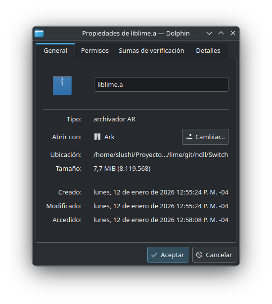
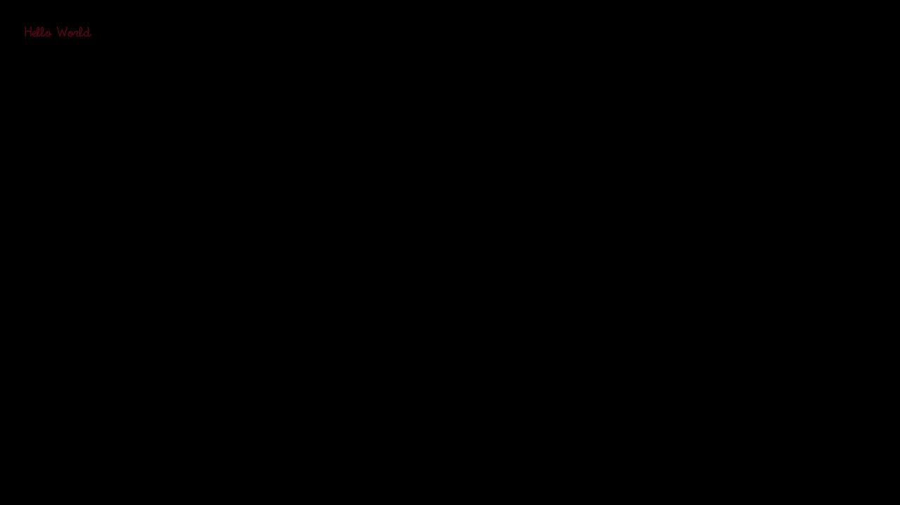

# EXPERIMENTAL FORK FOR THE NINTENDO SWITCH

YEAH, FINALLY SOMETHING FUNCTIONAL!

```bash
haxelib run lime rebuild switch -D static_link
```



Capture an OpenFL project from a real Nintendo Switch:



Based on the commit ``68107ee`` (From  Sep 18, 2025)

----